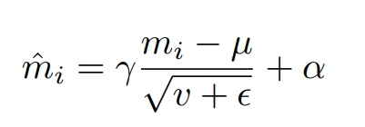

The idea:
 Force the image X to have the similiar feature to conditional image Y by normalize feature of image input X to have similiar distribution to image Y

Current works used Feature normalization to normalize the feature distribution of a layer close to the distribution of 'Discriminative feature' extracted from pre-trained metric model.
- **Formulation**

  

where mi is the input, ˆmi is the normalized output, µ is the mean, v is the
variance and epsilon is a small constant. In conventional normalization layers, the
scale γ and bias α terms are learned model parameters, while for conditional
normalization layers, they are learned as a function of some image Y

- Spatially-adaptive normalization ...