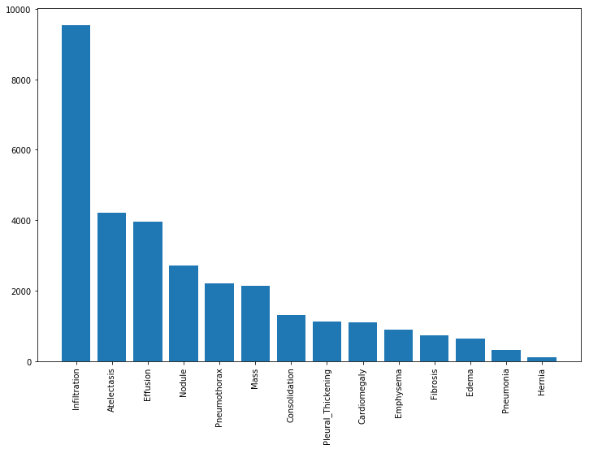

## The GAN project for chest-xray classification

### History table
| commit hash | comment |
|--|--|
| 97f1dba8dc6f8f69acac35bdcc6588add513035f | remove bagan_old |

### Chest-xray 14 dataset

1. samples count (multi-class sample are removed)

| Category | samples |
|--|--|
| No Finding | 60361 |
| Infiltration | 9547 |
| Atelectasis | 4215 |
| Effusion | 3955 |
| Nodule | 2705 |
| Pneumothorax | 2194 |
| Mass | 2139 |
| Consolidation | 1310 |
| Pleural_Thickening | 1126 |
| Cardiomegaly | 1093 |
| Emphysema | 892 |
| Fibrosis | 727 |
| Edema | 628 |
| Pneumonia | 322 |
| Hernia | 110 |

2. Data distribution (Without No finding case)

  
