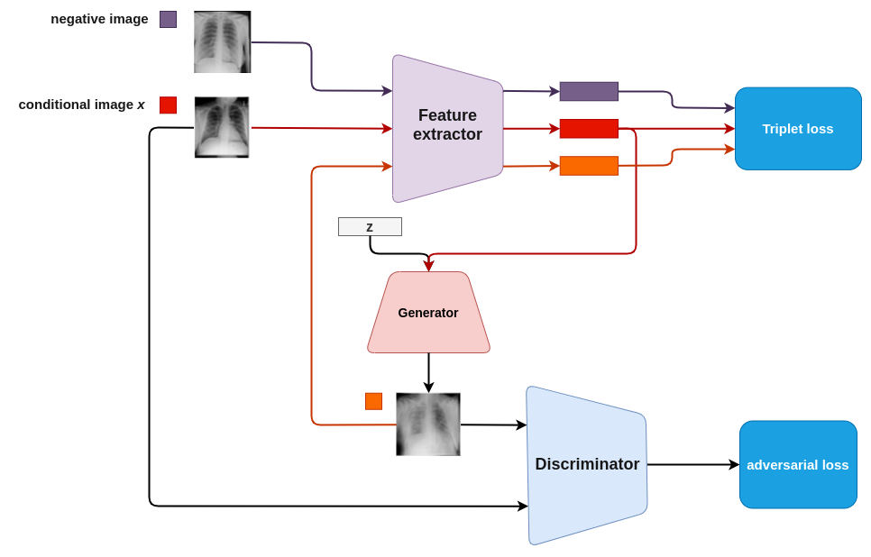
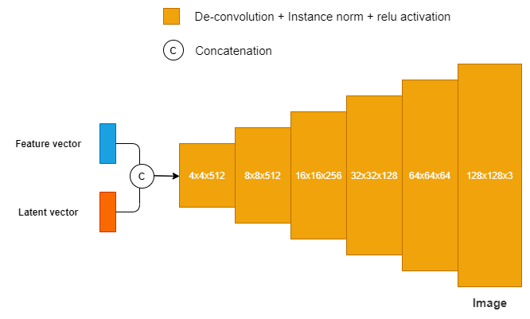
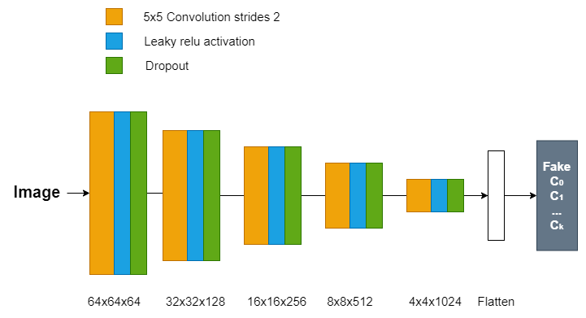
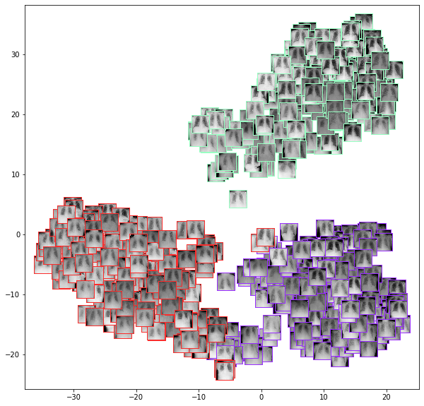
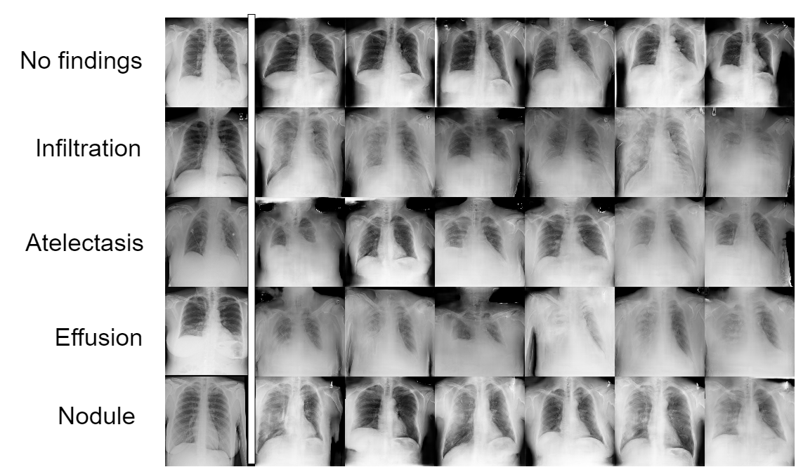
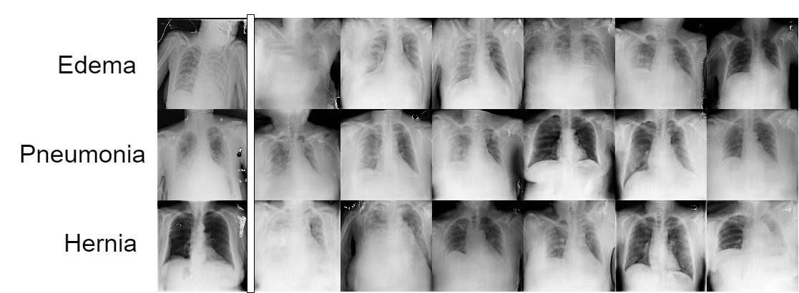

# The FX-GAN for chest-xray classification

- This repository is implemented based on https://github.com/IBM/BAGAN
- To run the experiment please check the file **notebooks/fxgan.ipynb**

### Generator architecture

### Discriminator architecture

# Experiment results

### Data distribution of generated images (feature extracted from pre-trained metric model)

### Generated images for 05 seen classes

### Generated images for 03 unseen classes

